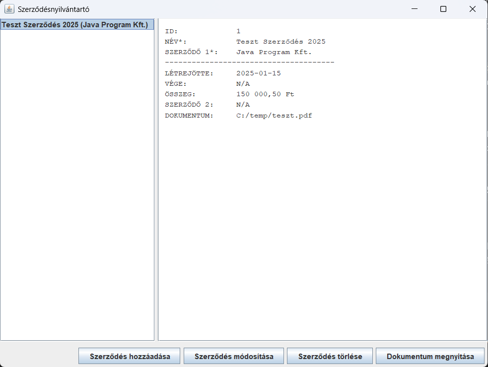
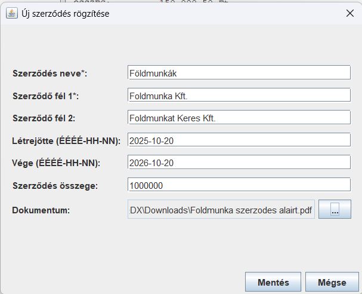
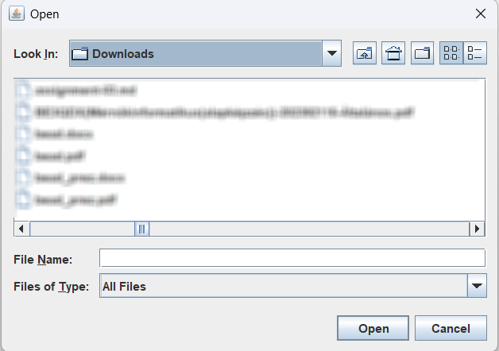

# Szerződésnyilvántartó Asztali Alkalmazás

Ez a projekt a "Programozás 3" tantárgy keretében készült beadandó feladat. A program egy asztali Java Swing alkalmazás, amely egy cég szerződéseinek nyilvántartására szolgál. Az adatok kezelését és tárolását egy beágyazott SQLite adatbázis végzi.

---

## 🚀 Főbb funkciók (Features)

Az alkalmazás teljeskörű CRUD (Create, Read, Update, Delete) funkcionalitást biztosít a szerződések kezelésére:

* **Szerződések listázása:** Az összes rögzített szerződés megjelenítése a főablakban.
* **Részletek megtekintése:** Egy szerződést kiválasztva az összes hozzá tartozó adat megjelenik.
* **Új szerződés rögzítése:** Grafikus űrlapon keresztül új szerződések adhatók meg, kötelező mezők validálásával.
* **Szerződés módosítása:** Meglévő szerződések adatai betöltődnek az űrlapba és módosíthatók.
* **Szerződés törlése:** Kijelölt szerződés törlése a listából és az adatbázisból (megerősítés után).
* **Fájlkezelés:**
    * Szerződésekhez tetszőleges fájl (pl. PDF dokumentum) csatolása.
    * A csatolt dokumentum megnyitása közvetlenül az alkalmazásból, az operációs rendszer alapértelmezett programjával.

---

## 🛠️ Felhasznált Technológiák

* **Programozási nyelv:** Java
* **Grafikus felület (GUI):** Java Swing
* **Adatbázis:** SQLite (beágyazott, szervermentes)
* **Adatbázis-kapcsolat:** JDBC (sqlite-jdbc driver)
* **Projektkezelés:** Apache Maven (függőségkezelés)
* **Fejlesztői környezet:** Visual Studio Code

---

## ⚙️ Az alkalmazás futtatása

### Előfeltételek

* Java Development Kit (JDK) 11 vagy újabb.
* (Opcionális) Apache Maven (ha parancssorból buildeli).

### Indítás IDE-ből (Ajánlott)

1.  Klónozza (vagy töltse le) a projektet.
2.  Nyissa meg a projektet a VS Code-ban (vagy más Java-t támogató IDE-ben).
3.  Telepítse a Maven függőségeket (ha az IDE nem teszi meg automatikusan).
4.  Keresse meg a `src/main/java/com/github/csucsuy/MainAppWindow.java` fájlt.
5.  Futtassa a fájlban található `main()` metódust.

### Adatbázis
Az alkalmazás az első indításkor automatikusan létrehozza a `szerzodesek.db` nevű adatbázisfájlt a projekt gyökérkönyvtárában.

---

## 📸 Az alkalmazás működése (Képernyőfotók)

### 1. Főablak

Az alkalmazás megnyitásakor a főablak fogad, amely két fő részre oszlik: bal oldalon a szerződések listája, középen pedig a kiválasztott szerződés részletei láthatók.

### 2. Új szerződés rögzítése

Az "Szerződés hozzáadása" gombra kattintva megnyílik az adatbeviteli ablak. A csillaggal jelölt mezők kitöltése kötelező.

### 3. Fájl csatolása

Az adatbeviteli ablakban a "..." gombra kattintva az operációs rendszer fájlválasztója nyílik meg, ahol kiválasztható a csatolni kívánt dokumentum.

### 4. Módosítás és Törlés

A főablakban kiválasztott szerződés adatai a "Szerződés módosítása" gombbal szerkeszthetők, vagy a "Szerződés törlése" gombbal (megerősítés után) eltávolíthatók.

### 5. Dokumentum megnyitása

Ha egy kiválasztott szerződéshez tartozik csatolt fájl, a "Dokumentum megnyitása" gomb aktívvá válik. Rákattintva a fájl megnyílik az alapértelmezett társított programmal (pl. PDF olvasó).

---

## 💡 Jövőbeli fejlesztési lehetőségek

Az alkalmazás jelenlegi funkcionalitása stabil alapot biztosít, amelyre a jövőben számos hasznos bővítés építhető:

---

### 🔍 Keresés és szűrés:

Egy gyorskereső mező hozzáadása a főablakba, amely név, szerződő fél vagy dátum alapján valós időben szűri a szerződések listáját.

Egy részletes kereső panel implementálása, ahol komplexebb feltételek (pl. összegtartomány, dátumintervallum) is megadhatók.

---

### 👤 Felhasználókezelés és jogosultságok:

Egy bejelentkező ablak (LoginWindow) és egy users adatbázistábla létrehozása.

Különböző jogosultsági szintek bevezetése (pl. "Admin", "Alkalmazott"). Az adminisztrátorok módosíthatnak és törölhetnek, míg az egyszerű alkalmazottak esetleg csak olvasási vagy rögzítési joggal rendelkeznének.

---

### 📈 Statisztikák és riportok:

Egy új fül vagy ablak, ahol egyszerű kimutatások láthatók (pl. "Hány szerződés jár le a következő 30 napban?", "Melyik partnerrel van a legtöbb aktív szerződés?").

Adatok exportálása CSV vagy PDF formátumba.

---

### 🔔 Emlékeztetők és értesítések:

A program indulásakor egy felugró ablak, amely figyelmeztet a hamarosan lejáró szerződésekre (a "Szerződés vége" dátum alapján).

---

### 🗃️ Kategorizálás és címkézés:

Lehetőség címkék (pl. "IT", "Marketing", "Bérlés") hozzárendelésére a szerződésekhez, és ezek alapján történő csoportosítás.

---

### 🎨 UI/UX fejlesztések:

A program kinézetének beállítása az operációs rendszer natív "Look and Feel"-jére a professzionálisabb megjelenés érdekében.

Ikonok elhelyezése a gombokon (pl. "Hozzáadás" mellett +, "Törlés" mellett X).

---

## 🏛️ Programterv és Architektúra

Az alkalmazás egy 5 fősztályból álló, jól elkülönített felelősségű architektúrát követ:

1.  **Modell (Model):** `Contract.java`
    * POJO (Plain Old Java Object), amely a szerződés adatait tárolja (getterek, setterek).
2.  **Adatbázis-kapcsolat (Connection):** `DatabaseManager.java`
    * Felelős az SQLite kapcsolat fizikai létrehozásáért és a táblák inicializálásáért.
3.  **Adatkezelő (DAO):** `ContractDAO.java`
    * Data Access Object réteg. Ez az osztály végzi az összes SQL (CRUD) műveletet. Ez az egyetlen osztály, ami közvetlenül kommunikál az adatbázissal.
4.  **Nézet/Vezérlő (View/Controller):**
    * `MainAppWindow.java`: A fő alkalmazásablak (JFrame). Kezeli a lista és a részletek megjelenítését, valamint a gombok eseményeit.
    * `ContractEditorWindow.java`: A modális ablak (JDialog) az űrlap kezelésére.

*(A részletes UML diagramok a projekt dokumentációjában találhatók.)*

---

## 🧑‍💻 Készítette

Grasics Patrik,
2025. november